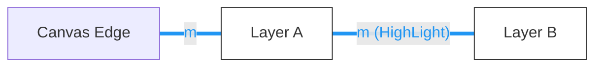
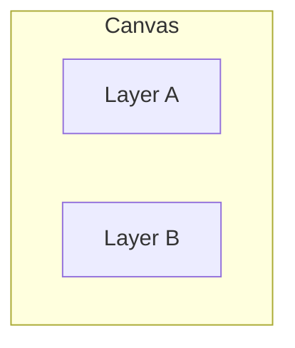
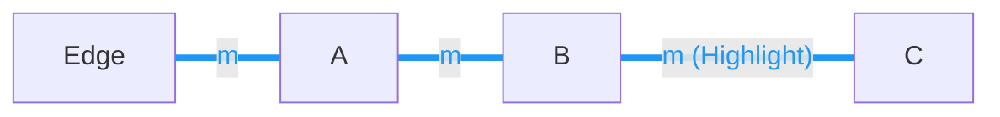

# Layer 等距感应与 Padding 高亮需求

## 1. 需求概述
在编辑器中拖动图层（Layer）时，系统应自动感应当前图层与周围图层或背景图边缘的间距。若间距趋于相等（在设定的吸附阈值内），则触发**自动吸附**并**视觉高亮**相关间距区域，辅助用户实现精准的等距排版。

layer.offset 坐标为画布原点。都以画布原点为准。 layer 区域按 layer 的宽高算，如果 layer 是旋转的，那么按垂直 x/y 的方框包裹为区域。

## 2. 核心逻辑定义
- **吸附阈值 (Threshold)**：当间距接近目标值（如 5-8 像素， 可自定义）时触发自动吸附。
- **投影重合触发**：
    - **水平感应**：仅当图层在垂直方向（Y 轴）上有投影重叠时触发。
    - **垂直感应**：仅当图层在水平方向（X 轴）上有投影重叠时触发。
- **级联高亮**：当形成等距序列时，所有相关的间距块（Gap/Margin）需同步高亮。

## 3. 详细测试用例 (以水平排列为例)

### Case 1: 边距与间距感应 (Margin = Gap)
- **场景**：图层 A 距离左侧背景图边缘距离为 `m`。
- **交互**：移动图层 B 使其靠近 A。当 A 与 B 的间距接近 `m` 时，B 自动吸附。
- **高亮表现**：同时渲染 A 左侧的边缘高亮块（Margin）和 A 与 B 之间的间距高亮块（Gap）。



**示意图：**
```text
|←-- m --→[  A  ]←-- m --→[  B  ]
背景图边缘      固定层      吸附高亮层
```


### Case 2: 排除非相关图层
- **场景**：图层 A 和图层 B 在水平方向排布，但在垂直方向（Y 轴）上完全没有坐标重叠。
- **规则**：此时不触发高亮逻辑，避免在垂直错位过大时产生错误的视觉辅助。



**示意图：**
```text
[  A  ] 
   (垂直投影不重叠，无间距感应)
               [  B  ]
```


### Case 3: 多图层等距序列 (Multi-Layer Equidistance)
- **场景**：存在图层 A、B、C。已知 A 距左边 `m`，A 与 B 间距也是 `m`。
- **交互**：向右移动图层 C。当 B 与 C 的间距接近 `m` 时，C 自动吸附。
- **高亮表现**：级联高亮 A 左侧 Margin、A-B 间隙及 B-C 间隙。这能直观地向用户展示这是一个完美的等距序列。



**示意图：**
```text
|←-- m --→[  A  ]←-- m --→[  B  ]←-- m --→[  C  ]
边缘      (高亮)      (高亮)      (吸附高亮)
```


### Case 4: 中心分布感应 (Mid-point Snap)
- **场景**：图层 A 和图层 C 位置固定，中间留有空隙。
- **交互**：向 A、C 之间拖动图层 B。当 `Gap(A, B)` 趋近于 `Gap(B, C)` 时，B 自动吸附至中心中点。
- **高亮表现**：同步高亮显示左右两侧相等的间距块。这在不需要参考边距，只需多个元素均匀分布时非常有用。

```mermaid
graph LRkeyInternalSize
    A[Layer A] -- d (Highlight) --- B[Layer B] -- d (Highlight) --- C[Layer C]
    linkStyle 0,1 stroke:#2196F3,stroke-width:4px,color:#2196F3
```

**示意图：**
```text
[  A  ]←--- d ---→[  B  ]←--- d ---→[  C  ]
固定层    (高亮)    吸附中点    (高亮)    固定层
```


### Case 5: 物理重叠处理 (Overlap Handling)
- **场景**：两个图层 A 和 B 在视觉上已经发生物理重叠（矩形区域有交集）。
- **规则**：当发生重叠时，**不触发** Padding 等距感应逻辑，仅保留中心对齐或边缘对齐感应。
- **目的**：避免在图层叠放时出现杂乱的间距高亮，确保辅助线只在“排版间距”场景下出现。

**示意图：**
```text
[  A  [重叠]  B  ] 
   (物理重叠时，禁用等距感应)
```


---     
*补充：垂直方向（Top/Bottom）感应遵循与上述水平方向完全一致的对称逻辑。*